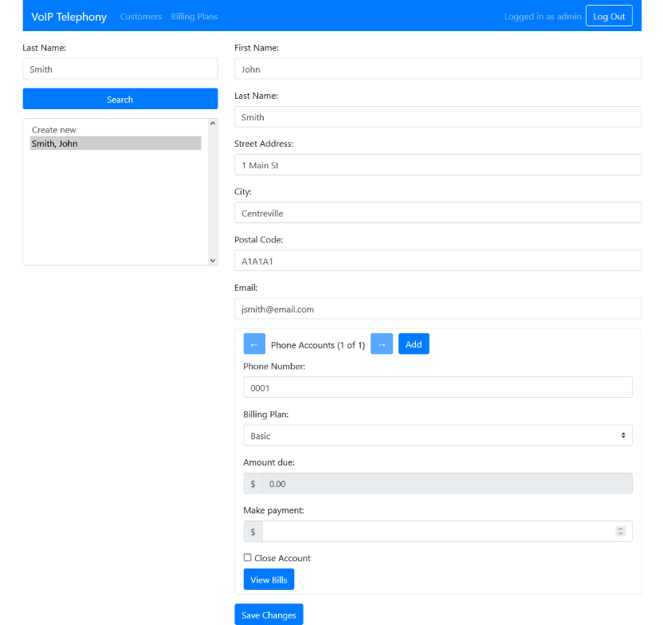
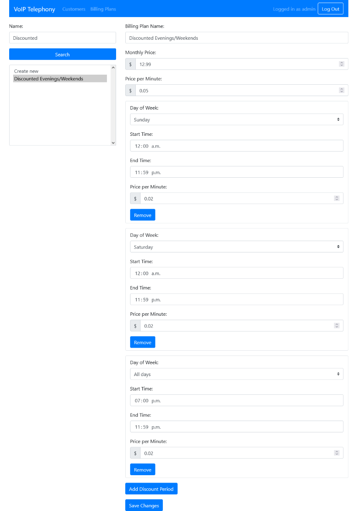

# Model Phone System

## Description

This system is a recreation of my university design project.  It features an administrative UI, pretend phone processes
(the original university version interacted with Nortel IPPhones), and a server back-end that ties everything together.

## Installation/Setup

The project's base directory has a Docker Compose file that will run the client and server, as well as MongoDB and Redis instances.
The MongoDB instance will be populated with sample data located in `/mongo-init/mongo-init.js`.  The phone emulator is a desktop app
(using `tkinter`), and is most easily run on its own.  It requires the client portion of `python-socketio` (check `requirements.txt`).

Some environment variables are set in `docker-compose.yml`.  The server's session password is currently provided in plain-text
(`SESSION_PWD`) for ease of demonstration, but it can also be provided as a file/secret (`SESSION_PWD_FILE`) using a bind mount.
The system does not use https by default, but it can be enabled by uncommenting options on both client and server, and providing
key and certificate files.

## Usage

The admin UI is available at `http://localhost:3000` by default, and requires a login (username `admin`, password `admin`).  The admin UI
can be used to add customers, who may have multiple phone accounts associated with them.  Each phone account needs a unique four-digit 
number (`####` can be entered to have the system generate one automatically), as well as a billing plan.  Billing plans have a per month 
cost, a per minute cost, and optional discount periods.  Discount periods can apply to one day of the week, or all days of the week.  Also, 
discount periods cannot overlap, with the exception of single day discount periods taking precedence over all week discount periods.  It is 
possible to change a phone account's billing plan mid billing period; the monthly charges will be pro-rated based on when the change occurred.  
Once a day (currently set to 12AM EST), the database is queried for any bills that have reached the threshold of a month active.  The bills are 
then finalized, and new bills are opened to replace them.  If a phone account reaches three unpaid bills, it is automatically suspended until 
at least one bill has been paid off in full.

Phone emulator processes can be started with `python phone_emulator.py <phone_number> <server_address>`.  When using default settings, the
server will be at `http://localhost:5000`, and phone accounts will be created for `0001`, `0002`, and `0003`.  To make a call, you must first
press a button that represents taking the phone off its hook, then dial a four-digit combination for another phone.  If the call is connected,
you can 'talk' by typing into a text box and pressing enter.  Your conversation will then be displayed by the emulators on both sides.

## Screenshots

## License
MIT